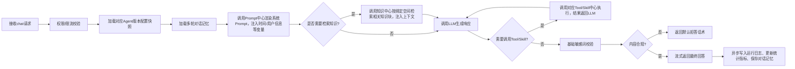

# Agent 中台化方案 V2
## 1. 方案定位与核心目标
### 1.1 核心目标
基于现有知识库系统演进，打造面向智能体开发的垂直能力平台，**核心解决智能体开发过程中的重复造轮子问题**：
- 可复用能力统一沉淀、统一管理，一次开发全平台复用
- 通用运行时逻辑100%下沉，新智能体开发80%的重复代码不需要再写
- 全链路可观测、可追溯、可治理，迭代、回滚、灰度不需要业务改代码发版
### 1.2 本质定位
不是通用API网关，是**面向智能体场景的垂直PaaS+能力资产市场**：统一入口只占整体代码量<5%，95%核心价值聚焦在能力沉淀、运行时引擎、治理观测上，和现有知识库系统平滑融合，不做推倒重来。
### 1.3 核心设计原则
#### 必须坚持的原则
1. **复用优先**：所有核心能力优先复用现有代码，不重写已有成熟组件（检索Pipeline、LLM客户端、SSE推送、ORM框架、依赖注入体系）
2. **零侵入兼容**：现有代码通过装饰器即可纳管，支持渐进式迁移，不要求业务一次性重构
3. **版本不可变**：所有资产（Prompt/Tool/Skill/Agent）发布后的版本永不修改，变更必须发新版本，发布时绑定全量依赖快照，底层升级不影响线上业务
4. **最小化第一期**：第一期只做最小可用闭环，不提前做重治理、重功能，6周内交付可生产版本，后续功能按需迭代
5. **边界清晰**：各中心职责单一，通过标准API通信，不直接访问对方数据库，可独立演进
#### 第一期明确不做的内容（避免范围蔓延）
- 独立MCP Server生命周期管理、MCP自动批量发现
- 可视化拖拽工作流编排、多Agent协作
- 复杂RBAC权限体系、发布审批流、操作审计
- 多模型路由、智能降级、成本自动分摊
- 代码沙箱隔离、断点续跑、人工转接
- 多渠道接入（微信/企微/钉钉）、跨Agent共享记忆
- 复杂评测体系、AB测试、根因分析
### 1.4 整体架构
三层架构 + 六大核心中心，薄运行时组装：
```
┌─────────────────────────────────────────────────────┐
│  应用层：前端管理台、OpenAPI、SDK                     │
├─────────────────────────────────────────────────────┤
│  Agent运行时（薄组装层，无状态，不存储数据）          │
│  记忆加载→Prompt渲染→知识检索→LLM决策→工具/技能调用→流式返回
├─────────────────────────────────────────────────────┤
│  六大核心中心（能力层，独立演进）                     │
│  Prompt资产中心 | 工具能力中心 | 技能流程中心         │
│  知识资产中心   | Agent配置中心 | 运行观测中心        │
├─────────────────────────────────────────────────────┤
│  底座层：复用现有系统能力                           │
│  PostgreSQL | Milvus | 火山LLM/Embedding | MinIO | Dramatiq
└─────────────────────────────────────────────────────┘
```
---
## 2. 六大核心中心最小化设计
所有中心第一期只保留核心字段和核心能力，后续功能按需迭代：
### 2.1 Prompt资产管理中心
> 全平台提示词唯一可信源，替代所有硬编码Prompt
#### 核心模型（2张表，符合现有SQLAlchemy风格）
| 表名 | 核心字段 | 说明 |
|---|---|---|
| `prompt_templates` | `prompt_id` PK、`prompt_key` UK（全局唯一调用标识，`域.场景.功能`命名）、`name`、`description`、`scene`、`current_stable_version_id` FK、`current_beta_version_id` FK、`owner`、`status`、`created_at/updated_at` | 逻辑Prompt模板，一个场景对应一个模板 |
| `prompt_versions` | `version_id` PK、`prompt_id` FK、`version_no`（从1递增）、`content`（支持字符串/OpenAI消息数组两种格式，JSONB存储）、`variables`（变量定义列表，包含name/type/required/default/description，JSONB）、`output_schema`（JSON Schema，JSONB）、`change_log`、`status`（draft/active/deprecated）、`published_at`、`created_at` | 不可变版本，历史版本永久保留 |
| `prompt_call_logs` | `call_id` PK、`trace_id/run_id/agent_id`、`prompt_id/version_id`、`variables`（脱敏）、`latency_ms`、`success`、`error_msg`、`created_at` | 调用日志，异步写入，不阻塞主链路 |
#### 第一期核心能力
1. 模板/版本基础CRUD、版本发布/回滚、`stable/beta/latest`别名机制
2. 统一`render`接口：服务端渲染、变量必填校验、输出Schema自动追加格式约束
3. Python客户端薄封装：本地内存缓存、自动重试、上下文自动注入（agent_id/run_id）
4. 多级缓存：本地内存缓存 + 版本发布主动失效，降级兜底（缓存失效时返回最近成功版本）
5. 前端基础管理页：模板列表、版本编辑、在线调试、调用记录查询
#### 复用现有能力
- 复用现有`llm/prompts.py`作为兜底降级内容
- 复用现有JSON序列化、错误处理逻辑
---
### 2.2 工具能力中心
> 全平台原子可执行能力统一管控入口，MCP工具不单独建表，统一纳入Tool模型
#### 核心模型（2张表）
| 表名 | 核心字段 | 说明 |
|---|---|---|
| `tool_definitions` | `tool_id` PK、`tool_name` UK（给LLM看的调用名，小写下划线）、`display_name`、`description`（传给LLM的功能说明）、`tool_type`（python_adapter/http_api/mcp_tool）、`is_dangerous`（是否危险工具，默认false）、`is_idempotent`（是否幂等，幂等才自动重试）、`current_stable_version_id` FK、`current_beta_version_id` FK、`owner`、`tags`、`status`、`created_at/updated_at` | 逻辑工具定义，统一纳管三类工具 |
| `tool_versions` | `version_id` PK、`tool_id` FK、`version_no`、`capability_schema`（OpenAI Function Calling格式参数Schema，JSONB）、`timeout_ms`（默认30s）、`retry_config`、`auth_config`（加密存储）、`tool_config`（差异化配置：Python入口点/HTTP地址方法/MCP服务和工具名，JSONB）、`change_log`、`status`、`published_at`、`created_at` | 不可变版本 |
| `tool_call_logs` | `call_id` PK、`trace_id/run_id/agent_id`、`tool_id/version_id`、`arguments`（脱敏）、`result`（摘要）、`latency_ms`、`retry_count`、`success`、`error_msg`、`created_at` | 调用日志 |
#### 第一期核心能力
1. 三种注册方式：`@tool`装饰器自动注册（自动从类型注解/docstring生成Schema）、HTTP工具表单注册、MCP工具手动配置
2. 执行器注册模式，支持三类工具执行：Python本地调用（线程池隔离）、HTTP接口调用、MCP stdio协议调用
3. 统一`call`接口：参数自动校验、超时控制、幂等工具自动重试1次、异常统一捕获返回结构化错误、熔断降级（错误率>50%熔断5分钟）
4. 细粒度权限：危险工具需要单独授权才能绑定给Agent
5. 前端管理页：工具列表、版本管理、在线调试、调用记录
#### 复用现有能力
- 复用现有`parsers/registry.py`的注册表模式实现执行器注册
- 复用现有HTTP客户端、线程池、异常处理逻辑
---
### 2.3 技能流程中心
> 全平台标准化业务SOP沉淀中心，固定多步流程黑盒调用，避免LLM自由发挥走偏流程
#### 核心模型（2张表）
| 表名 | 核心字段 | 说明 |
|---|---|---|
| `skill_definitions` | `skill_id` PK、`skill_name` UK（调用名）、`display_name`、`description`（传给LLM的功能说明）、`skill_type`（code/workflow/mcp_skill，第一期只支持code）、`need_human_confirm`（是否需要人工确认，第一期不实现，预留字段）、`current_stable_version_id` FK、`current_beta_version_id` FK、`owner`、`tags`、`status`、`created_at/updated_at` | 逻辑技能定义 |
| `skill_versions` | `version_id` PK、`skill_id` FK、`version_no`、`input_schema`/`output_schema`、`depends_on`（依赖的Prompt/Tool/Skill ID和版本，JSONB，自动扫描）、`skill_config`（代码入口点/流程定义/MCP配置，JSONB）、`timeout_ms`（默认5分钟）、`change_log`、`status`、`published_at`、`created_at` | 不可变版本，第一期仅支持代码型技能 |
| `skill_call_logs` | `call_id` PK、`trace_id/run_id/agent_id`、`skill_id/version_id`、`arguments`（脱敏）、`result`（摘要）、`step_details`（步骤详情，JSONB）、`latency_ms`、`success`、`error_step`、`error_msg`、`created_at` | 调用日志，记录每一步执行情况 |
#### 第一期核心能力
1. `@skill`装饰器自动注册：自动扫描依赖的Prompt/Tool、自动生成入参出参Schema，现有多步流程加装饰器即可纳管，零代码改造
2. 简单流程调度：支持顺序执行、条件分支，步骤自动调用对应中心的接口（Prompt渲染/Tool调用/Skill嵌套）
3. 统一`call`接口：参数校验、步骤级超时和错误处理、步骤日志自动记录
4. 接口调用格式和Tool完全一致，LLM和上层不需要区分Tool和Skill
#### 复用现有能力
- 复用现有`ingestion/pipeline.py`的流程执行思路
- 复用现有`Dramatiq`异步任务执行长耗时技能
---
### 2.4 知识资产中心
> 现有知识库系统平滑演进为平台知识入口，Agent不直接耦合底层检索细节
#### 第一期极简实现（不新建核心表）
1. **知识空间第一期复用现有`knowledge_chunks.category`字段**：一个分类对应一个知识空间，不需要额外建表，配置空间ID到分类的映射即可
2. 统一`search_by_space`接口：接收空间ID列表、查询参数，自动转换为现有检索Pipeline的过滤条件（categories/knowledge_types/doc_ids），完全复用现有向量+BM25双路检索、RRF融合、LLM Rerank能力
3. 检索日志自动同步到运行观测中心，和Agent Run关联
4. 前端知识空间管理页极简：列表展示现有分类，支持编辑空间名称、描述、绑定文档范围
#### 后续迭代方向（第一期不实现）
后续再逐步新增知识空间表、版本发布流、权限隔离、快照能力，第一期完全复用现有检索底座，不重写核心逻辑。
#### 复用现有能力
- 100%复用现有`retrieval/pipeline.py`的混合检索能力
- 复用现有`documents/parsed_elements/knowledge_chunks`表和入库Pipeline
---
### 2.5 Agent配置中心
> 所有智能体统一注册、配置、发布入口，零代码搭建Agent
#### 核心模型（3张表）
| 表名 | 核心字段 | 说明 |
|---|---|---|
| `agent_definitions` | `agent_id` PK、`name`、`description`、`agent_type`（第一期只支持rag_chat）、`avatar`、`tags`、`owner`、`visibility`（private/public）、`current_stable_version_id` FK、`current_beta_version_id` FK、`status`、`usage_count`、`success_rate`、`created_at/updated_at` | 逻辑Agent定义 |
| `agent_versions` | `version_id` PK、`agent_id` FK、`version_no`、`prompt_bindings`（绑定的Prompt和版本，JSONB快照）、`tool_bindings`（绑定的Tool列表和版本，JSONB快照）、`skill_bindings`（绑定的Skill列表和版本，JSONB快照）、`knowledge_bindings`（绑定的知识空间和检索配置，JSONB快照）、`model_config`（模型名、temperature、max_tokens，JSONB）、`memory_config`（多轮对话开关、最大轮数，JSONB）、`welcome_message`、`suggested_questions`（推荐问题，JSONB）、`change_log`、`status`、`gray_config`（灰度配置，JSONB）、`published_at`、`created_at` | 不可变版本，发布时快照所有依赖配置，保证历史版本可复现 |
| `agent_conversations` | `conversation_id` PK、`agent_id`、`user_id`、`messages`（对话历史，JSONB）、`last_message_at`、`created_at/updated_at` | 多轮对话记忆存储，TTL自动清理7天前的历史 |
#### 第一期核心能力
1. 零代码可视化配置：选系统Prompt、勾选需要的Tool/Skill、绑定知识空间、调整模型参数、设置开场白和推荐问题，10分钟配置出可用RAG Agent
2. 版本管理：发布/回滚/灰度（按流量比例/白名单切流），发布时自动快照所有依赖，底层资产变更不影响线上Agent
3. 统一`chat`接口：支持流式SSE返回和非流式返回，自动加载对话记忆
4. 公共Agent模板：内置通用RAG问答模板，一键复制快速创建新Agent
5. 前端管理页：Agent列表、配置页、版本管理、在线调试台
#### 复用现有能力
- 复用现有`app/api/v1/jobs.py`的SSE推送能力实现流式返回
- 复用现有`llm_client`作为统一模型调用入口
---
### 2.6 运行观测中心
> 全链路运行数据统一采集、展示、排查入口
#### 核心模型（2张表）
| 表名 | 核心字段 | 说明 |
|---|---|---|
| `agent_runs` | `run_id` PK、`agent_id/version_id`、`conversation_id`、`trigger_type`（api/manual）、`caller_app_id/user_id`、`query`、`answer`、`status`（queued/running/completed/failed）、`token_usage`（JSONB）、`latency_ms`、`error_msg`、`feedback`（1点赞/-1点踩）、`feedback_comment`、`started_at/ended_at` | Agent一次调用主记录 |
| `agent_run_steps` | `step_id` PK、`run_id` FK、`sequence`（执行顺序）、`step_type`（memory_load/prompt_render/knowledge_search/llm_call/tool_call/skill_call）、`step_name`、`input`（脱敏摘要）、`output`（脱敏摘要）、`latency_ms`、`token_usage`、`success`、`error_msg`、`target_id/target_type/target_version`（调用的资产ID/类型/版本，可跳转）、`created_at` | 执行步骤详情，全链路可追溯 |
#### 第一期核心能力
1. 全链路埋点自动采集：所有Prompt/Tool/Skill/Knowledge/LLM调用步骤自动记录，不需要业务手动打日志
2. 运行列表和详情回放：按Agent/时间/状态筛选，详情页按时间线展示每一步执行情况，点击可跳转对应资产版本
3. 基础统计看板：Agent调用量、成功率、平均耗时、Token消耗Top排行
4. 用户反馈收集：对话页点赞/点踩，反馈和Run记录关联
#### 复用现有能力
- 复用现有`DbSearchLog`/`DbIngestJob`的日志落库模式
- 复用现有前端dashboard的统计卡片风格
---
## 3. Agent运行时（薄组装层，无状态）
第一期Runtime极简，不做复杂逻辑，只做流程组装，所有能力调用对应中心接口：

> 核心原则：Runtime不直接实现任何具体能力，所有能力调用都走对应中心的标准API，新增能力不需要修改Runtime核心逻辑。
---
## 4. 分阶段开发计划（从地基开始，6周交付第一期）
### Phase 0：底座收敛（0.5周，地基阶段）
#### 核心目标
梳理现有能力边界，统一公共工具类，为后续开发打基础，不新增业务功能
#### 开发内容
1. 统一依赖注入：在现有`app/core/deps.py`中预留六大中心客户端的注入位，和现有组件风格一致
2. 统一基础工具类：封装Pydantic基类、ID生成工具（雪花ID/UUID）、JSON序列化工具、脱敏工具、时间工具
3. 统一ORM基类：复用现有`models.py`的`Base`和`_now`时间戳方法，新增通用CRUD仓储基类，避免重复写增删改查代码
4. 统一异常体系：定义平台统一异常类（权限错误/参数错误/不存在/限流/降级），和现有全局异常处理对接
5. 梳理现有代码：明确哪些能力直接复用，哪些需要薄封装
#### 复用现有能力
- 100%复用现有SQLAlchemy Base、数据库连接、依赖注入体系、全局异常处理
#### 交付产物
- 通用基类和工具类代码
- 依赖注入位预留
- 现有能力复用清单
#### 验收标准
- 现有服务正常启动，不影响现有文档入库、检索、搜索功能
---
### Phase 1：Prompt中心核心能力（1周）
#### 核心目标
跑通Prompt的创建-发布-渲染-调用最小链路
#### 开发内容
1. 数据层：编写`prompt_templates/prompt_versions/prompt_call_logs`三张表的Alembic迁移脚本、ORM模型、仓储类
2. 后端API：模板/版本CRUD接口、发布/回滚接口、`render`渲染接口、调用记录查询接口
3. Prompt渲染核心逻辑：变量替换（支持字符串/多轮消息格式）、必填校验、输出Schema自动追加
4. Python客户端封装：本地内存缓存、自动重试、上下文注入、降级兜底
5. 前端页面：模板列表页、版本编辑页、在线调试页
#### 复用现有能力
- 复用现有`llm/prompts.py`作为兜底内容
- 复用现有前端组件风格、API请求封装
#### 交付产物
- Prompt中心可运行版本
- 前端基础管理页
- Python客户端包
#### 验收场景
1. 创建一个「门店运营助手系统提示词」模板，编辑v1版本，发布为stable
2. 调用`prompt_client.render("agent.store_ops.system", variables={"current_date": "2026-07-08"})`成功返回渲染后的内容
3. 编辑v2版本发布后，调用自动返回v2内容，回滚后自动返回v1内容
4. 模拟数据库故障，客户端自动返回缓存内容不报错
---
### Phase 2：Tool中心核心能力（1周）
#### 核心目标
跑通Tool的注册-发布-调用最小链路，支持三类工具
#### 开发内容
1. 数据层：`tool_definitions/tool_versions/tool_call_logs`三张表迁移脚本、ORM模型、仓储类
2. 执行器体系：执行器抽象基类、注册表，实现Python本地执行器（线程池隔离）、HTTP API执行器、MCP stdio执行器（极简版）
3. `@tool`装饰器实现：自动从函数注解、docstring生成OpenAI Function Schema，服务启动时自动扫描注册
4. 后端API：工具CRUD接口、版本发布接口、`call`调用接口、调用记录查询接口
5. 工具调用核心逻辑：参数校验、超时控制、幂等自动重试、熔断降级、异常统一处理
6. 前端页面：工具列表页、版本编辑页、在线调试页
#### 复用现有能力
- 复用现有`parsers/registry.py`注册表模式实现执行器注册
- 复用现有HTTP客户端、线程池
#### 交付产物
- Tool中心可运行版本
- @tool装饰器
- 前端管理页
#### 验收场景
1. 给现有kb_search函数加`@tool`装饰器，服务启动后自动注册到平台
2. 手动注册一个HTTP天气查询工具
3. 配置MCP文件读取工具，手动录入注册
4. 调用`tool_client.call("kb_search", {"query": "怎么做门店拉新"})`成功返回检索结果
5. 工具超时/报错时自动返回结构化错误，不抛出异常
---
### Phase 3：Skill中心核心能力（1周）
#### 核心目标
跑通Skill的注册-发布-调用最小链路，支持代码型多步流程
#### 开发内容
1. 数据层：`skill_definitions/skill_versions/skill_call_logs`三张表迁移脚本、ORM模型、仓储类
2. `@skill`装饰器实现：自动扫描依赖的Prompt/Tool、自动生成Schema，服务启动自动注册
3. 简单流程调度引擎：支持顺序执行、条件分支，步骤自动调用对应中心接口，记录步骤日志
4. 后端API：Skill CRUD接口、版本发布接口、`call`调用接口、调用记录查询接口
5. 前端页面：Skill列表页、版本详情页、调用记录页
#### 复用现有能力
- 复用现有`ingestion/pipeline.py`流程执行思路
- 复用Dramatiq执行长耗时Skill
#### 交付产物
- Skill中心可运行版本
- @skill装饰器
- 前端管理页
#### 验收场景
1. 给现有「Excel自动入库」多步流程加`@skill`装饰器，自动注册到平台，自动识别依赖的kb_search工具
2. 调用`skill_client.call("excel_auto_ingest", {"file_id": "xxx"})`成功走完入库全流程
3. 调用日志里可以看到每一步的执行详情、耗时、结果
---
### Phase 4：知识空间极简封装 + Agent配置中心（1.5周）
#### 核心目标
跑通Agent配置-发布-对话最小链路，第一阶段闭环
#### 开发内容
1. 知识空间极简实现：基于现有category字段做映射，实现统一`search_by_space`接口，不需要新建表
2. 数据层：`agent_definitions/agent_versions/agent_conversations/agent_runs/agent_run_steps`五张表迁移脚本、ORM模型、仓储类
3. Agent Runtime核心实现：对话流程调度（记忆加载→Prompt渲染→知识检索→LLM调用→工具调用→返回结果）
4. 后端API：Agent CRUD接口、版本发布/灰度接口、`chat`对话接口（流式SSE+非流式）、运行记录接口
5. 依赖校验：Agent发布时自动检查绑定的Prompt/Tool/Skill/知识空间是否存在、有权限
6. 前端页面：Agent配置页（选Prompt/勾工具/绑知识空间/调模型参数）、对话调试页、运行列表页、运行详情回放页
7. 多轮对话记忆：基于`agent_conversations`表实现上下文自动加载和保存，7天自动过期
#### 复用现有能力
- 100%复用现有`retrieval/pipeline.py`检索能力
- 复用现有`jobs.py`SSE能力实现流式返回
- 复用现有`llm_client`做模型调用
#### 交付产物
- Agent可运行版本
- 零代码配置页
- 运行观测基础能力
#### 验收场景
1. 10分钟配置出「门店运营助手」：绑定系统Prompt、kb_search工具、门店运营知识空间、doubao-pro模型
2. 调用chat接口问「怎么做门店拉新」，正确检索知识返回回答，支持流式返回打字机效果
3. 运行详情页可以看到完整执行链路：加载记忆→渲染Prompt→检索知识→LLM调用→返回结果，点击可跳转对应Prompt/Tool版本
4. 多轮对话上下文生效，第二轮问「那怎么做会员运营」时不需要重复上下文
5. 发布v2版本配置20%灰度，请求按比例命中v2版本，一键回滚到v1立刻生效
---
### Phase 5：前端体验完善 + 测试 + 文档（1周）
#### 核心目标
优化体验，修复bug，输出文档，达到生产可用标准
#### 开发内容
1. 前端页面交互优化：统一导航、权限控制（管理员/普通用户两级）、表单校验、错误提示
2. 基础统计看板：复用现有dashboard风格，展示Agent数量、总调用量、成功率、平均耗时等核心指标
3. 全链路测试：单元测试、接口测试、集成测试，覆盖核心流程
4. 接入文档编写：API文档、SDK使用文档、Agent配置指南
5. 基础限流、敏感词校验能力
#### 交付产物
- 生产可用的第一期版本
- 完整接入文档
- 测试用例覆盖核心流程
#### 验收标准
- 所有核心流程无阻塞bug，性能达标（单Agent对话响应时间<3s）
- 文档清晰，新用户可以根据文档10分钟配置出可用Agent
---
## 5. 兼容与迁移方案
1. **零侵入纳管**：现有工具/流程只需要加`@tool`/`@skill`装饰器即可自动注册到平台，不需要修改原有业务逻辑
2. **渐进式迁移**：新开发的Agent统一走平台，存量业务可以继续使用原有逻辑，逐步替换，不需要一次性重构
3. **部署兼容**：第一期所有API直接挂载到现有FastAPI服务的`/api/v1/platform/`路径下，和现有documents/search/jobs接口同进程运行，不需要额外部署服务，运维成本为0
4. **平滑升级**：后续功能迭代通过新增接口实现，不修改第一期核心接口，业务代码不需要跟随升级
---
## 6. 第一期最小闭环总体验收标准
1. 所有代码基于现有技术栈开发，核心组件100%复用，无额外中间件依赖
2. 6周内开发完成，不延期，交付后可直接上线使用
3. 新用户可以在10分钟内零代码配置出一个可用的RAG Agent，具备对话、知识检索、工具调用能力
4. 每一次Agent调用全链路可追溯，运行详情可以看到每一步执行情况
5. 版本发布、灰度、回滚操作一键完成，不需要改代码发版
6. 公共Prompt/Tool/Skill一次发布，所有Agent可以复用，不需要重复开发
---
## 7. 后续迭代方向（第一期交付后按需规划）
第一期交付后根据实际业务需求逐步迭代，不提前做过度设计：
1. 第2-3个月：MCP自动发现、简单评测能力、基础权限优化、用户反馈分析
2. 第3-6个月：工作流编排、多渠道接入、多模型路由、成本统计
3. 6个月后：人工转接、开放生态、高级治理能力
